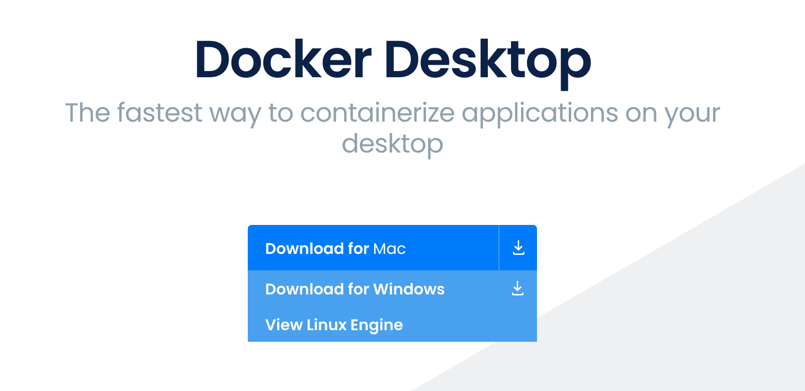

## What is Docker

> A standardized unit of software"

- docker.com

Docker is container runtime environment.

It isolates all software dependencies required to build and run an application into one neat and small (mostly) container.

### So what?

Well instead of installing Node.js, NPM, NVM, MongoDB, PHP on your LAPTOP all you have to do is pull down a Docker IMAGE that already has that software packaged inside of it ready for your to insert your web app into.

### so how does it work?

All you have to do use is pull down an image and build a container from it, it is in this container that your code will live.


You manage your containers using the Docker application on your development machine.

You manage your containers using the docker CLI (command line interface)

```bash
docker --help
```

You can:

- create
- delete
- publish
- configure

## Install Docker



### Clone image

```bash
docker pull node
```

Head over to your project and create Dockerfile.

```bash
cd docker-101
```

## Dockerfile

The Dockerfile is a configuration file that tells Docker:

```bash
touch Dockerfile
```

Then configure it

```bash
FROM node:12-alpine
WORKDIR /app
COPY . .
RUN yarn install --production
CMD ["node", "src/index.js"]
```

1. **FROM** what software to use
2. **WORKDIR** to put your website
3. **COPY** which website files to place in which folder in the docker container, first dot is your root, second dot is container root
4. **RUN** Installation commands for node app
5. **CMD** which node starter commands to run when the container is finished building

## Build container

```bash
docker build -t docker-101 .
```

## Run your first container

```bash
docker run -d -p 8080:8080 --name docker-101 docker-101
```

## What is a container?

## Now save and share your image

Save and share your image on Docker Hub to enable other users to easily download and run the image on any destination machine.
